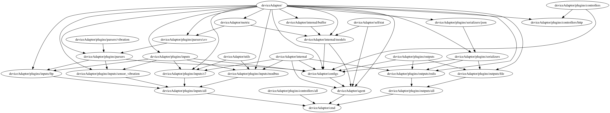

# 统一数据监控平台

主要为解决以下问题而设计：

- 避免从OPC取数据，直接从PLC获取数据
- 统一控制流程问题，指令的发送、调度、回调等
- 统一数据格式问题，避免维护多种输出或输出的类型、格式等

# Structure

# Plugins

- Controller
  - [x] http
  - [ ] redis
  - [ ] websocket
- Input
  - [x] ftp
  - [x] modbus
  - [x] s7
- Output
  - [x] file
  - [x] redis
- Parser
  - [x] csv
- Serializer
  - [x] json

## TODO:

- [ ] 配置流程Server化
- [ ] 配置更新后，程序Reload功能